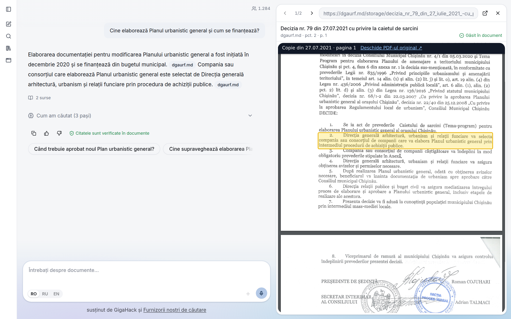
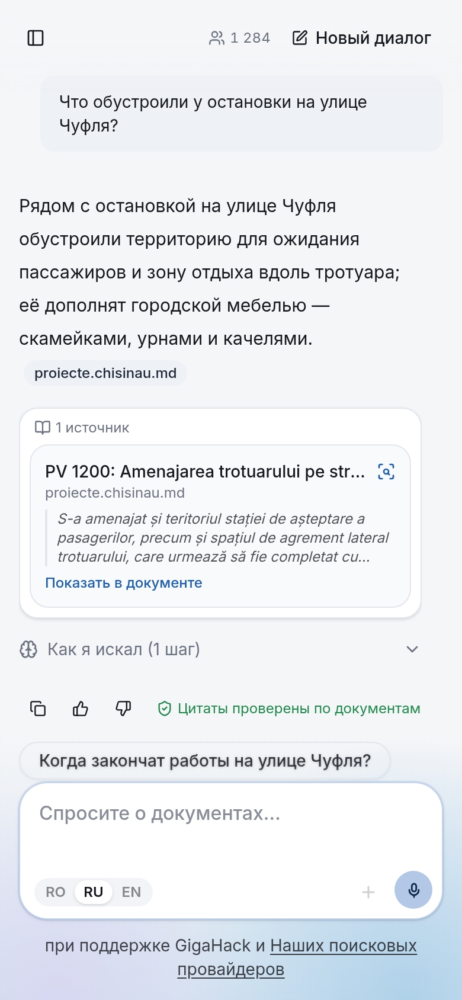
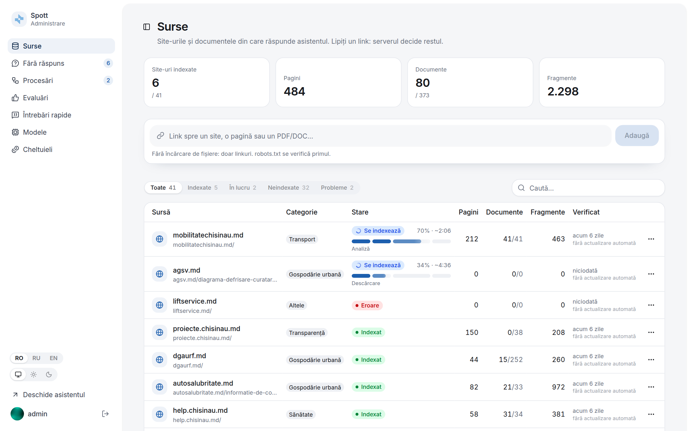

# Spott: Chișinău Municipal Assistant

An AI assistant for the Chișinău City Hall (Primăria Municipiului Chișinău) that answers questions from citizens and municipal employees in **Romanian and Russian**, using **only** the City Hall's public documents, and shows the exact document and passage behind every answer.

Built for the Primăria Chișinău challenge at DeepTech GigaHack 2026. **Live demo: [spott-sepia.vercel.app](https://spott-sepia.vercel.app)**



| A Russian question answered from Romanian documents | Admin: sources, processing, unanswered questions, spending |
|---|---|
|  |  |

<sub>Screenshots use the demo answers in `frontend/src/lib/mocks/`, which come from the real index.</sub>

---

## The problem

The information people need is spread across many municipal websites: council decisions, mayor's dispositions, regulations, procedures, contacts, schedules. Much of it is published as PDFs, and many of those are scanned paper documents.

A generic chatbot can't be trusted here. An answer that is incomplete, outdated or invented can mislead someone about their rights, obligations or the procedure they need to follow.

## What the assistant does

Mapped one-to-one to the challenge brief.

### Must-have

| Requirement | How we meet it | Status |
|---|---|---|
| **Answer questions from a defined corpus** | The corpus is built only from the Annex 1 websites. Answers are generated only from passages retrieved from it, never from the model's general knowledge. | ✅ |
| **Romanian and Russian** | Questions in either language, answer in the same language. Retrieval works across languages, so a Russian question can be answered from a Romanian-only document. | ✅ |
| **Cite the exact document and passage** | Every answer cites the act (type, number, date), the passage quoted verbatim, the page and point (e.g. *Decizia nr. 12/14 din 28.07.2020, pct. 5, p. 2*), and links to the original on the City Hall website. Quotes come from the index, with PDF page boxes for highlighting. | ✅ |
| **Flag missing information** | If retrieval finds nothing relevant enough, the answer is `not_found`: the assistant says the corpus doesn't cover the question instead of guessing; `partial` says which part is missing. | ✅ |
| **Flag contradictions** | If sources disagree, the answer is `conflict` and cites all of them with their dates. Example: an older decision amended by a newer one. `outdated` (a newer act replaces the older) is told apart from a real `contradiction`. | ✅ in answers<br>⏳ corpus-wide scan |
| **Website navigation** | Answers include links to the relevant page: a department's contacts, a service portal, a procedure page. Every crawled page (URL, title, language versions) is in the registry. An embeddable widget puts the assistant on any City Hall site. | ✅ links in answers, site widget<br>⏳ highlighting the element on the page |
| **Monthly model-maintenance budget** | External API vs self-hosted model, deployment location, estimated monthly cost. See [Budget](#budget). | ⏳ |

### Bonus

| Requirement | How | Status |
|---|---|---|
| **Feedback on answers** | 👍 / 👎 with an optional comment on each answer, stored together with the question, the answer and its sources, so weak spots of the corpus or the retrieval become visible. | ✅ in the chat, reviewed in the admin panel |
| **Innovative solution** | See [What's innovative](#whats-innovative). | partly ✅ |

## What's innovative

- **Scanned acts become searchable and citable.** Most official acts on the sites, such as council decisions and mayor's dispositions, are published as scans with no text at all. The pipeline OCRs them and recovers their structure (points, tables), so they can be cited down to the point. A plain text extractor would find nothing in them. ✅
- **Every quote is traceable.** Each passage carries its full provenance: the file, the page of the PDF, the point of the act, the website page where the document was published, and the link text used there. ✅
- **Document lineage.** The registry keeps every version of a document, and act numbers and dates are extracted. "Se modifică / se abrogă" references between acts are parsed into act relations, so when a later decision amends or repeals the act being cited, the answer quotes that line too instead of presenting an outdated rule as current. ✅
- **Publication quality report for the City Hall.** Cross-checking the site against the documents reveals inconsistencies. We already found a link labelled "Dispoziția nr. 23/1" whose document is actually a *Decizie*. Collected into a report, these checks help the City Hall fix its own publications. ⏳
- **Anti-hallucination guard.** The model never writes quotes. It only points at numbered lines of the retrieved passages; the quotes are taken from the index, a sentence without a backing line is dropped, and a sentence whose numbers don't appear in its quotes is marked unverified. ✅

## How it works

The system has two halves. **Offline indexation** turns the City Hall websites into a searchable, citable corpus. The **online** part answers questions against that corpus.

```
                        OFFLINE INDEXATION                                        ONLINE
┌───────────┐   ┌─────────┐   ┌────────────┐   ┌─────────┐   ┌────────────┐
│ 42 public │──►│ crawler │──►│ downloader │──►│ parsing │──►│ chunking + │──► index ◄── backend ◄── frontend
│ websites  │   └─────────┘   └────────────┘   └─────────┘   │  indexing  │             (retrieval,   (chat,
└───────────┘   pages, doc    files, dedup     text, OCR,    └────────────┘              LLM answer    RO / RU)
                links         by SHA-256       structure     Postgres+pgvector           with citations)
                     └──────────────┴────────────────┴── SQLite registry ──┘
```

### Offline indexation

Each stage is a separate command. The stages share one SQLite registry (`data/registry.sqlite`), so every stage is incremental and can be re-run on its own.

1. **Crawler.** Breadth-first crawl of the sites listed in Annex 1. It records every page and every link to a document (PDF, DOC/DOCX, XLS/XLSX, ODT, …), including where the link was found and its anchor text. This provenance is later used for citations. On WordPress sites it also reads the media library API, which finds files that no page links to. It respects `robots.txt` and rate limits, and can resume after an interruption.
2. **Downloader.** Stores files by content hash (`data/raw/<sha256>.<ext>`). Deduplication happens at three levels:
   - URLs already downloaded are skipped;
   - re-checks use conditional HTTP requests, so unchanged files return `304 Not Modified` without a body;
   - identical content found under different URLs is stored and parsed once.

   A changed file keeps its previous version in the history.
3. **Parsing.** Converts each file into a structured text representation using [Docling](https://github.com/docling-project/docling):
   - layout analysis recovers headings, numbered points and tables;
   - OCR (Apple Vision on macOS, Tesseract elsewhere) handles scanned pages. Most official acts on the sites are scans;
   - text normalization fixes Romanian diacritics (ş/ţ → ș/ț) and mixed Latin/Cyrillic look-alike characters;
   - metadata extraction pulls out act type, number, date and language (ro / ru / uk / en).
4. **Chunking and indexing.** Splits documents into citable passages along their structure (article / point `legal_path`, headings attached) and into single **lines**, so a fact that lives in one line can be found and quoted on its own. Everything goes into Postgres 17 + pgvector:
   - vector search with the multilingual `bge-m3` model (one space for Romanian and Russian), over passages and over lines;
   - full-text search with Romanian and Russian stemming (unaccented), plus trigram `grep` for exact act numbers and street names;
   - results are fused with weighted RRF; each hit carries a deep link to the PDF page (`#page=N`) or the exact text on the web page (`#:~:text=`).

   Documents are keyed by their source URL: a changed file **replaces** the old version in the index (history stays in the registry), and a document missing from the site on two crawls in a row is removed. Unchanged text reuses its embeddings.
5. **Agent tools.** `search`, `grep`, `toc` and `open` let the LLM walk the corpus like a file tree and quote lines by their id (available over HTTP at `/api/tools/*`, with OpenAI function-calling schemas).

### Online

- **Backend** (FastAPI, contract in [docs/API.md](docs/API.md)). Retrieves the most relevant passages and gives the LLM their lines, numbered. The model answers only from them and marks which lines back each sentence; the quotes are then taken from the index (never written by the model), sentences without a backing line are dropped, and a sentence whose numbers don't appear in its quotes is marked unverified. Answers stream over SSE (`/api/ask/stream`).
- **Frontend** (Next.js). Chat interface with a Romanian / Russian switch. It shows each answer with its sources and navigation links.

## Parsed document format

Each document becomes `data/parsed/<sha256>.json`, shortened here:

```json
{
  "metadata": {
    "title": "Cu privire la aprobarea Planului de acțiuni pentru elaborarea ...",
    "doc_type": "decizie", "number": "12/14", "date": "2020-07-28", "lang": "ro"
  },
  "sources": [{
    "url": "https://dgaurf.md/storage/decizie-1214-din-28.07.2020-(1).pdf",
    "found_on": "https://dgaurf.md/ro/documentatii-de-urbanism",
    "found_on_title": "Documentații de urbanism",
    "anchor_text": "Decizia CMC privind elaborarea PUG"
  }],
  "pages":  [{ "n": 1, "text_layer": false }, "..."],
  "blocks": [
    { "id": 7, "type": "list_item", "marker": "1.", "page": 1, "section": ["DECIZIE"], "lang": "ro",
      "text": "1. Se aprobă Planul de acțiuni pentru elaborarea Planului de amenajare a teritoriului ..." },
    { "id": 12, "type": "table", "page": 1, "header": ["Nr. crt.", "Nume și prenume", "Funcția", "Rol în grup"],
      "rows": [["1", "...", "...", "Președinte"]] }
  ]
}
```

The same content is also written as Markdown (`<sha256>.md`) for reading and debugging. The raw Docling output (`<sha256>.docling.json`) is cached so the corpus can be rebuilt without running OCR again.

## Data sources

The corpus is built from the websites listed in the challenge's Annex 1: 42 domains across transparency, urban mobility, architecture and utilities, education, healthcare, district administrations, and public services. The list, with per-site crawl settings, is in [`offline_indexation/data/sources/sites.toml`](offline_indexation/data/sources/sites.toml).

> `chisinau.md` disallows all crawling in its `robots.txt`, so it is skipped by default. It can be enabled per site with `ignore_robots = true` once crawling has been agreed with the City Hall.

## Repository layout

The repository is a uv workspace (`offline_indexation`, `backend`, `packages/retrieval`) plus the separate Next.js frontend:

| Directory | Stack | Purpose |
|---|---|---|
| [`offline_indexation/`](offline_indexation) | Python 3.14, uv, Docling | Corpus building: `crawler`, `downloader`, `parsing`, `pages_parsing`, `chunking`, `indexing`, `eval`, `tools` (doctor, pipeline, index export/import) |
| [`packages/retrieval/`](packages/retrieval) | Python 3.14, pgvector, bge-m3 | Shared search engine: hybrid retrieval, agent tools, `qsearch` console |
| [`backend/`](backend) | Python 3.14, uv, FastAPI | Question answering API |
| [`frontend/`](frontend) | Node, Next.js 16 | Chat UI |

## Run the backend in Docker (one command)

Needs only Docker. Put the index dump (`index-YYYY-MM-DD.dump`, made with `tools.index_io export` on the machine that has the index) into `data/export/`, then:

```bash
./start.sh            # database + API + admin worker → http://localhost:8000
./start.sh --public   # also a public https://….trycloudflare.com address (for the Vercel frontend), no server needed
./start.sh --https    # on a server with its own domain: Caddy + Let's Encrypt for DOMAIN from .env
./start.sh --stop
```

The first run asks for the OpenAI key and writes `.env` (random database and admin passwords, printed once); the first build downloads ~3 GB (CPU-only torch, the bge-m3 model baked into the image). On start the API container creates the schema, restores the dump into an empty database, fills the sources and builds the contact cards. A server that should update itself on every push to `main`: set the `DEPLOY_*` secrets described in `.github/workflows/ci.yml`.

## Getting started

**New here or testing on Mac / Windows: follow [docs/TESTER.md](docs/TESTER.md)** (in Russian): install, load the ready-made index dump, check the setup, test search in the console. Technical notes on every pipeline stage, eval and benchmarks: [docs/README.ru.md](docs/README.ru.md).

Quick start with a ready index dump (Docker Desktop running):

```bash
cp .env.example .env                  # Windows: copy .env.example .env
uv sync --all-packages
cd offline_indexation
uv run python -m tools.index_io import <path/to/index-YYYY-MM-DD.dump>   # starts the DB container, loads the index
uv run python -m tools.doctor                                           # environment check
cd .. && uv run qsearch                                                 # console search (RO / RU)
```

Cross-platform maintenance commands (run in `offline_indexation/`; `scripts/*.sh` are thin wrappers for Mac/Linux):

| Command | What it does |
|---|---|
| `uv run python -m tools.pipeline update` | refresh already crawled sites, replace changed documents, drop removed ones, re-index |
| `uv run python -m tools.pipeline full [--only crawler downloader]` | full crawl of all allowed sites (never `chisinau.md`) |
| `uv run python -m tools.index_io export` | dump the index to `data/export/` (not committed) |

### Running stages by hand

**Prerequisites:** [uv](https://docs.astral.sh/uv/), Node.js 20+. Parsing uses Apple Vision OCR on macOS. On Linux it falls back to Tesseract, which needs the `ron` and `rus` language packs installed.

### Offline indexation

```bash
cd offline_indexation
uv sync

uv run python -m crawler --list                          # configured sites
uv run python -m crawler --max-depth 2 --max-pages 200   # 1. crawl (quick pass); --resume continues an interrupted crawl
uv run python -m downloader                              # 2. download new documents; --refresh re-checks known ones
uv run python -m parsing                                 # 3. parse into data/parsed/; --rebuild re-derives output without OCR
uv run python -m pages_parsing                           # 4. text of crawled HTML pages
docker compose up -d                                     #    (from the repo root) Postgres + pgvector
uv run python -m indexing                                # 5. chunk, embed and index (incremental)
```

Every command accepts `--help`. All generated data stays in `offline_indexation/data/` and is git-ignored.

The first parsing run downloads Docling's layout and table models, which takes a few minutes. After that, parsing takes about 1–3 s per page, including OCR, on an Apple M4.

### Backend

```bash
cd backend
uv run uvicorn app.main:app --reload --port 8000   # API docs at http://localhost:8000/docs
```

### Frontend

```bash
cd frontend
npm install
cp .env.example .env.local   # NEXT_PUBLIC_API_URL=http://localhost:8000
npm run dev                  # http://localhost:3000
```

## API

`POST /api/ask`

```json
{ "question": "Cum obțin certificatul de urbanism?", "lang": "ro" }
```

```json
{
  "status": "answered | partial | not_found | conflict | refused",
  "lang": "ro",
  "answer": "...",
  "sentences": [{ "text": "...", "cites": ["c1"] }],
  "citations": [{ "id": "c1", "document_title": "Decizia nr. 79 din 27.07.2021 ...", "location": "pct. 2", "page": 1,
                  "quote": "...", "translation": null, "url": "https://dgaurf.md/storage/...pdf", "preview_url": "..." }],
  "nav_links": [{ "title": "...", "url": "...", "kind": "page" }],
  "followups": ["..."]
}
```

Shortened; the full contract, including the streaming events of `/api/ask/stream`, is in [docs/API.md](docs/API.md). It is defined in [`backend/app/schemas.py`](backend/app/schemas.py) and mirrored in [`frontend/src/lib/api.ts`](frontend/src/lib/api.ts).

## Budget

*To be written.* This section will compare:
- an external LLM API against a self-hosted open model;
- where each would be deployed;
- the estimated monthly cost.

The cost will be split into indexing (one-off plus incremental) and answering (per question).

## Status

| Part | State |
|---|---|
| Crawler, downloader, parsing (incl. OCR) | ✅ working, tested on a subset of the sites |
| Chunking, line index, hybrid search (Postgres + pgvector) | ✅ ~0.1–0.2 s per query; the background worker indexes the remaining sites batch by batch |
| Document updates (replace, not duplicate; removal of vanished documents) | ✅ |
| Agent tools `search / grep / toc / open`, console `qsearch` for testers | ✅ |
| Cited answers `/api/ask` + `/api/ask/stream` (docs/API.md): answered / partial / not_found / conflict / refused, checklists, translations of quotes | ✅ fast path; agent path (`mode=deep`) ⏳ |
| Mac / Windows setup, CI on Linux + Windows (backend) and frontend lint + build | ✅ |
| Act lineage (amends / repeals) in answers | ✅ |
| Corpus-wide contradiction scan, highlighting the element on the page from the widget | ⏳ planned |
| Chat UI | ✅ streaming answers with inline citations, the source opened next to the answer with the quote highlighted (PDF and web pages), RO / RU / EN, light / dark, mobile; embeddable site widget |
| Admin panel | ✅ sources added by URL, processing jobs with progress, unanswered questions grouped by topic, ratings, quick questions, models and spending |
| Automatic updates | ✅ nightly check of what changed, weekly full refresh, earlier on users' signals |
| Feedback, live wall, corpus stats endpoints | ✅ |
| Legacy `.doc` files | ⏳ need LibreOffice for conversion |
| Monthly maintenance budget | ⏳ to be written |

## Team

Built at DeepTech GigaHack 2026 by [Natan Katsif](https://github.com/natankatsif), [Karnavski S.](https://github.com/rlwq), [TheMorkovkaBest](https://github.com/TheMorkovkaBest) and [Pooromens](https://github.com/Pooromens).

- **Natan Katsif**: chunking and the line index, hybrid search, the chat and admin UI, source preview.
- **Karnavski S.**: crawler, downloader, parsing and OCR; the answering API with verified citations, streaming, act lineage; admin backend and the background worker; Docker deploy.
