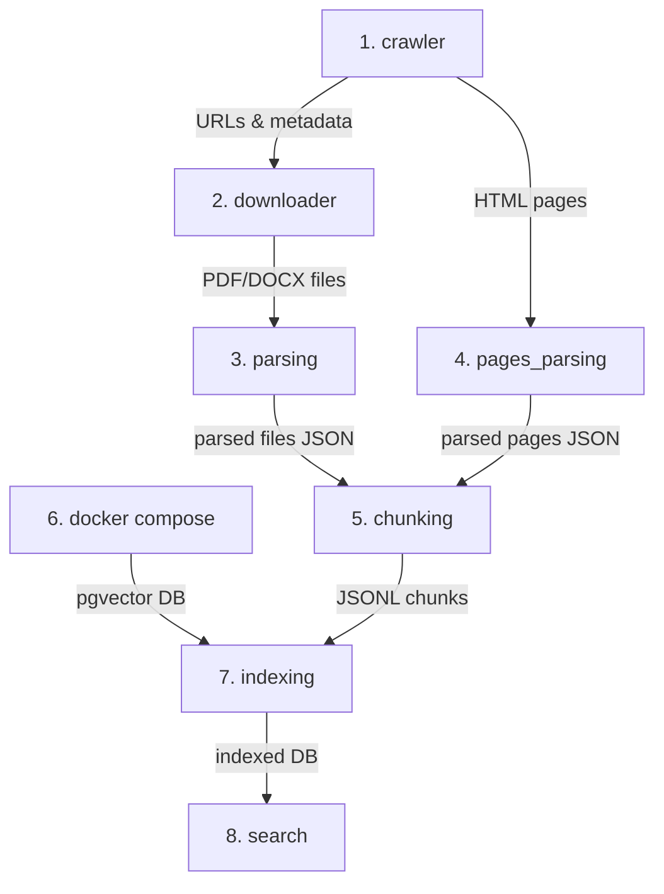

# Chișinău Municipal Assistant

AI-ассистент Примэрии Кишинэу (челлендж DeepTech GigaHack 2026): отвечает на вопросы граждан и сотрудников на румынском и русском **только по корпусу публичных документов**, цитирует документ и фрагмент, явно сообщает, если информации нет или документы противоречат друг другу, и направляет на нужную страницу сайта.

## Структура

Три независимых проекта:

| Папка | Стек | Назначение |
|---|---|---|
| [`offline_indexation/`](offline_indexation) | Python, uv | Сбор корпуса: обход сайтов из Annex 1, поиск документов, дальше — оцифровка (OCR) и индексация |
| [`backend/`](backend) | Python, uv, FastAPI | API ассистента: поиск по корпусу, ответ с цитатами |
| [`frontend/`](frontend) | Node, Next.js | Веб-чат (RO / RU) |

## Как запустить у друга за 5 минут

1. **Клонировать репозиторий:**
   ```bash
   git clone <repo-url>
   cd qwerty
   ```

2. **Создать `.env` со своим ключом OpenAI:**
   ```bash
   cp .env.example .env
   # Укажите актуальный OPENAI_API_KEY в .env
   ```

3. **Синхронизировать зависимости:**
   ```bash
   uv sync
   ```

4. **Импортировать готовый дамп индекса (без повторного парсинга и расчета векторов!):**
   ```bash
   # Получите файл дампа (например, data/export/index-2026-09-26.dump)
   ./scripts/import_index.sh data/export/index-2026-09-26.dump
   ```
   Скрипт поднимет `docker compose up -d`, создаст таблицы и индексы HNSW/GIN, загрузит 484 документа, 2 269 чанков и 9 906 строк с готовыми эмбеддингами.

5. **Запустить API-сервер:**
   ```bash
   cd backend
   uv run uvicorn app.main:app --port 8000
   ```
   API доступно по адресу `http://localhost:8000`, документация Swagger — `http://localhost:8000/docs`.

### Создание дампа для переноса
```bash
./scripts/export_index.sh
# Дамп сохраняется в data/export/index-<YYYY-MM-DD>.dump (в git не коммитится)
```


## Запуск

### Offline Indexation Pipeline

Пайплайн сбора, оцифровки и индексации данных состоит из 8 последовательных этапов. Все этапы координируются через реестр SQLite (`offline_indexation/data/registry.sqlite`) и локальные директории хранения.

#### Порядок выполнения и зависимости этапов:



#### Сводная таблица этапов:

| № | Модуль | Входные данные | Выходные данные | Сложность / Ресурсы | Назначение |
|---|---|---|---|---|---|
| **1** | `crawler` | `data/sources/sites.toml` | `registry.sqlite` | 🌐 Сеть (умеренно) | Обход муниципальных сайтов, сбор ссылок на акты и страниц |
| **2** | `downloader` | `registry.sqlite` | `data/raw/<sha>.<ext>` | 🌐 Сеть + Диск | Скачивание бинарных документов (PDF, DOCX, XLSX) |
| **3** | `parsing` | `data/raw/` | `data/parsed/<sha>.json` | ⚡ **Тяжёлый** (CPU/RAM/OCR) | Оцифровка через Docling: текстовый слой, OCR сканов, bboxes, таблицы |
| **4** | `pages_parsing` | `data/crawled/pages/` | `data/parsed/pages/*.json` | 🟢 Лёгкий (~секунды) | Парсинг текстовых страниц сайтов, очистка навигации, извлечение контактов |
| **5** | `chunking` | `data/parsed/` | `data/chunks/*.jsonl` | 🟢 Лёгкий (~1-2 сек) | Семантическая нарезка: привязка заголовков, `legal_path`, слияние <150 симв. |
| **6** | `docker compose` | `docker-compose.yml` | PostgreSQL порт 5432 | 🟢 Лёгкий | Запуск СУБД PostgreSQL 16 с расширением `pgvector` |
| **7** | `indexing` | `data/chunks/` или `data/parsed/` | Таблицы `documents`, `chunks` | ⚡ **Тяжёлый** (GPU/CPU, сеть) | Загрузка мультиязычной модели `bge-m3` (~2.3 GB), генерация векторов (1024 dim) и FTS-индекса |
| **8** | `indexing.search` | Пользовательский запрос | Ранжированный список цитат | 🟢 Быстрый (~50-100 мс) | Проверка гибридного поиска (RRF: FTS `simple` + Vector Cosine) с дедупликацией |

---

#### Команды и флаги запуска каждого этапа:

```bash
cd offline_indexation

# 1. Сбор ссылок (crawler)
uv run python -m crawler --list                          # Список поддерживаемых сайтов
uv run python -m crawler --max-depth 2 --max-pages 200   # Обход сайтов: страницы и документы
uv run python -m crawler --resume                        # Докачка прерванного обхода
uv run python -m crawler --site chisinau_decizii         # Обход конкретного источника

# 2. Скачивание файлов (downloader)
uv run python -m downloader                              # Скачать новые документы в data/raw/
uv run python -m downloader --refresh                    # Проверить обновления (HTTP 304 Not Modified)
uv run python -m downloader --limit 50                   # Скачать не более N файлов

# 3. Парсинг файлов (parsing) — ТЯЖЁЛАЯ ОПЕРАЦИЯ (Docling + OCR)
uv run python -m parsing                                 # Полный парсинг документов из data/raw/
uv run python -m parsing --rebuild                       # Быстрая пересборка JSON/MD из кэша без повторного OCR
uv run python -m parsing --limit 10                      # Ограничить N документами
uv run python -m parsing --file data/raw/sample.pdf      # Разобрать один файл

# 4. Парсинг HTML-страниц (pages_parsing)
uv run python -m pages_parsing                           # Парсинг сохранённых HTML в data/parsed/pages/
uv run python -m pages_parsing --limit 100               # Ограничение по числу страниц

# 5. Чанкинг корпуса (chunking) — БЫСТРАЯ ОПЕРАЦИЯ (~0.5 сек)
uv run python -m chunking                                # Нарезка всех документов и страниц в data/chunks/
uv run python -m chunking --files-only                   # Только файлы (PDF/DOCX)
uv run python -m chunking --pages-only                   # Только веб-страницы
uv run python -m chunking --limit 50                     # Лимит обработки

# 6. Запуск инфраструктуры хранения
docker compose up -d                                     # Запуск PostgreSQL 16 + pgvector

# 7. Индексация в БД (indexing) — ТЯЖЁЛАЯ ОПЕРАЦИЯ (загрузка весов ~2.3 GB + эмбеддинги)
uv run python -m indexing                                # Генерация эмбеддингов BGE-M3 и загрузка в pgvector
uv run python -m indexing --from-jsonl                   # Загрузить чанки из готовых data/chunks/*.jsonl
uv run python -m indexing --recreate                     # Полный пересоздание схемы БД
uv run python -m indexing --batch-size 32                # Размер батча эмбеддингов
uv run python -m indexing --clean-orphans                # Удалить из БД чанки, удалённые из корпуса

# 8. Проверка поиска (search)
uv run python -m indexing.search --query "bugetul municipal 2026"
uv run python -m indexing.search --query "компенсация за отопление" --lang ru --top-k 5
uv run python -m indexing.search --query "plan urbanistic" --doc-type decizie
```

**Backend** (http://localhost:8000, документация OpenAPI/Swagger — `/docs`):
```bash
# Запуск сервиса поиска и API
uv run uvicorn backend.app.main:app --port 8000
```

#### Примеры запросов через curl:

1. **Проверка работоспособности (`GET /health`)**:
```bash
curl -s http://localhost:8000/health | jq .
```
Ответ:
```json
{
  "status": "ok",
  "device": "mps",
  "models_loaded": true,
  "chunks_count": 2269,
  "pool_stats": {
    "pool_size": 2,
    "pool_available": 2,
    "requests_waiting": 0
  }
}
```

2. **Быстрый гибридный поиск без реранкера (`POST /api/search`, p95 ~106 ms)**:
```bash
curl -s -X POST http://localhost:8000/api/search \
  -H "Content-Type: application/json" \
  -d '{
    "query": "cum obtin autorizatie de constructie in chisinau",
    "k": 5,
    "rerank": false
  }' | jq .
```

3. **Поиск с кросс-энкодер реранкером (`POST /api/search` + `bge-reranker-v2-m3`)**:
```bash
curl -s -X POST http://localhost:8000/api/search \
  -H "Content-Type: application/json" \
  -d '{
    "query": "компенсация за отопление в кишиневе документы",
    "lang": "ru",
    "k": 5,
    "rerank": true
  }' | jq .
```

4. **Запрос без ответа в корпусе (`not_found: true`, threshold = 0.0093)**:
```bash
curl -s -X POST http://localhost:8000/api/search \
  -H "Content-Type: application/json" \
  -d '{
    "query": "tarife metrou chisinau abonament lunar",
    "k": 5,
    "rerank": true
  }' | jq .
```

#### Запуск бенчмарка задержек:
```bash
# Быстрый прогон без реранкера (48 запросов: 16 запросов x 3 прогона)
uv run python backend/scripts/bench_search.py --skip-rerank

# Полный бенчмарк (с реранкером и без)
uv run python backend/scripts/bench_search.py --runs 3
```

**Frontend** (http://localhost:3000):
```bash
cd frontend
npm install
cp .env.example .env.local
npm run dev
```

## Контракт API

- `GET /health` → статус сервиса, готовность моделей, размер индекса и пул БД.
- `POST /api/search` → `{ query, lang, count, not_found, results: [...], timings_ms: { embed, vector_sql, fts_sql, rerank, total } }`.
- `POST /api/ask` → `{ status: "answered" | "not_found" | "conflict", lang, answer, citations[], nav_links[] }`.
Описан в [`backend/app/schemas.py`](backend/app/schemas.py), зеркально — в [`frontend/src/lib/api.ts`](frontend/src/lib/api.ts).
