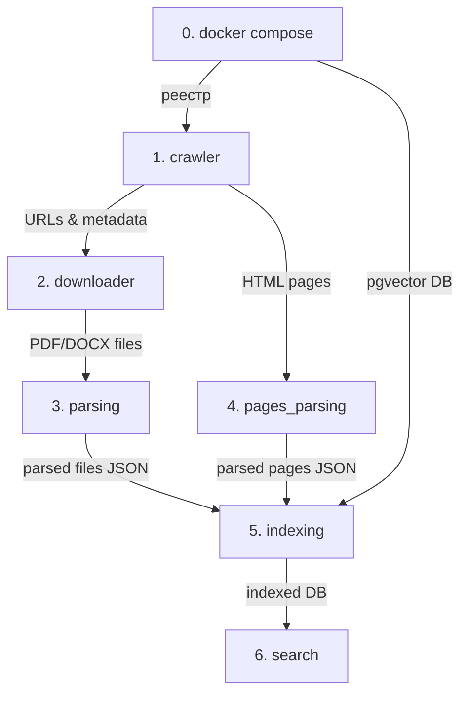

# Chișinău Municipal Assistant — технические заметки (RU)

> Основной README (EN, продукт и челлендж) — [../README.md](../README.md). Установка для тестировщика — [TESTER.md](TESTER.md).

AI-ассистент Примэрии Кишинэу (челлендж DeepTech GigaHack 2026): отвечает на вопросы граждан и сотрудников на румынском и русском **только по корпусу публичных документов**, цитирует документ и фрагмент, явно сообщает, если информации нет или документы противоречат друг другу, и направляет на нужную страницу сайта.

## Структура

Два независимых проекта, связанных только HTTP API (контракт: [`backend/openapi.json`](../backend/openapi.json)):

| Папка | Стек | Назначение |
|---|---|---|
| [`backend/`](../backend) | Python, uv | Один пакет `spott`: `core` (схема БД, эмбеддинги, поиск), `ingest` (сбор корпуса: обход сайтов из Annex 1, скачивание, OCR, индексация, worker админки), `api` (FastAPI: ответ с цитатами, админка). `api` и `ingest` зависят только от `core` |
| [`frontend/`](../frontend) | Node, Next.js | Веб-чат (RO / RU), админка, виджет |
| [`data/`](../data) | | Всё сгенерированное (обход, файлы, реестр, дампы, логи); в git только `data/sources/sites.toml` |

## Как запустить (Mac и Windows)

Пошаговая инструкция для тестировщика и для всех, кто ставит проект впервые: **[docs/TESTER.md](TESTER.md)**. Там же: что реализовано, как устроен Docker, консольный поиск `qsearch` и решение типичных проблем.

Коротко:

```bash
git clone <repo-url> qwerty && cd qwerty
cp .env.example .env                  # Windows: copy .env.example .env
cd backend
uv sync --all-extras
uv run python -m spott.ingest.tools.index_io import <path/to/index-YYYY-MM-DD.dump>   # поднимет Docker-базу и загрузит индекс
uv run python -m spott.ingest.tools.doctor         # проверка окружения
uv run qsearch                        # консольный поиск
```

API-сервер: `cd backend && uv run uvicorn spott.api.main:app --port 8000` → `http://localhost:8000/docs`.

Служебные команды (одинаково на Mac и Windows, из `backend/`):

| Команда | Что делает |
|---|---|
| `uv run python -m spott.ingest.tools.index_io export` | дамп индекса в `data/export/index-<дата>.dump` (в git не коммитится) |
| `uv run python -m spott.ingest.tools.pipeline update` | обновить уже обойдённые сайты: замена изменённых документов, удаление пропавших |
| `uv run python -m spott.ingest.tools.pipeline full [--only crawler downloader]` | полный обход всех разрешённых сайтов (без chisinau.md — robots.txt) |

`scripts/*.sh` — тонкие обёртки над этими командами для Mac/Linux.

## Запуск

### Offline Indexation Pipeline

Пайплайн сбора, оцифровки и индексации данных состоит из 7 последовательных этапов. Все этапы координируются через реестр (таблицы `registry_*` в Postgres) и локальные директории хранения, поэтому Postgres нужен с первого этапа.

#### Порядок выполнения и зависимости этапов:



#### Сводная таблица этапов:

| № | Модуль | Входные данные | Выходные данные | Сложность / Ресурсы | Назначение |
|---|---|---|---|---|---|
| **0** | `docker compose` | `docker-compose.yml` | PostgreSQL порт 5432 | 🟢 Лёгкий | PostgreSQL 17 с `pgvector`: реестр этапов, потом индекс |
| **1** | `crawler` | `data/sources/sites.toml` | реестр (Postgres) | 🌐 Сеть (умеренно) | Обход муниципальных сайтов, сбор ссылок на акты и страниц |
| **2** | `downloader` | реестр (Postgres) | `data/raw/<sha>.<ext>` | 🌐 Сеть + Диск | Скачивание бинарных документов (PDF, DOCX, XLSX) |
| **3** | `parsing` | `data/raw/` | `data/parsed/<sha>.json` | ⚡ **Тяжёлый** (CPU/RAM/OCR) | Оцифровка через Docling: текстовый слой, OCR сканов, bboxes, таблицы |
| **4** | `pages_parsing` | `data/crawled/pages/` | `data/parsed/pages/*.json` | 🟢 Лёгкий (~секунды) | Парсинг текстовых страниц сайтов, очистка навигации, извлечение контактов |
| **5** | `indexing` | `data/parsed/` | Таблицы `documents`, `chunks`, `lines` | ⚡ **Тяжёлый** (GPU/CPU, сеть) | Нарезка в памяти (привязка заголовков, `legal_path`, слияние <150 симв., секунды на корпус), затем модель `bge-m3` (~2.3 GB): векторы (1024 dim) и FTS-индекс |
| **6** | `indexing.search` | Пользовательский запрос | Ранжированный список цитат | 🟢 Быстрый (~50-100 мс) | Проверка гибридного поиска (RRF: FTS `simple` + Vector Cosine) с дедупликацией |

---

#### Команды и флаги запуска каждого этапа:

```bash
cd backend

# 0. Postgres + pgvector (из корня репозитория): реестр этапов, потом индекс
docker compose up -d

# 1. Сбор ссылок (crawler)
uv run python -m spott.ingest.crawler --list                          # Список поддерживаемых сайтов
uv run python -m spott.ingest.crawler --max-depth 2 --max-pages 200   # Обход сайтов: страницы и документы
uv run python -m spott.ingest.crawler --resume                        # Докачка прерванного обхода
uv run python -m spott.ingest.crawler --sites dgaurf.md               # Обход конкретных сайтов

# 2. Скачивание файлов (downloader)
uv run python -m spott.ingest.downloader                              # Скачать новые документы в data/raw/
uv run python -m spott.ingest.downloader --refresh                    # Проверить обновления (HTTP 304 Not Modified)
uv run python -m spott.ingest.downloader --limit 50                   # Скачать не более N файлов

# 3. Парсинг файлов (parsing) — ТЯЖЁЛАЯ ОПЕРАЦИЯ (Docling + OCR)
uv run python -m spott.ingest.parsing                                 # Полный парсинг документов из data/raw/
uv run python -m spott.ingest.parsing --rebuild                       # Быстрая пересборка JSON/MD из кэша без повторного OCR
uv run python -m spott.ingest.parsing --limit 10                      # Ограничить N документами
uv run python -m spott.ingest.parsing --sha 5c0d7f                    # Разобрать файлы по началу sha256

# 4. Парсинг HTML-страниц (pages_parsing)
uv run python -m spott.ingest.pages_parsing                           # Парсинг сохранённых HTML в data/parsed/pages/
uv run python -m spott.ingest.pages_parsing --limit 100               # Ограничение по числу страниц

# 5. Нарезка и индексация в БД (indexing) — ТЯЖЁЛАЯ ОПЕРАЦИЯ (загрузка весов ~2.3 GB + эмбеддинги)
uv run python -m spott.ingest.indexing                                # Нарезка, эмбеддинги BGE-M3 и загрузка в pgvector
uv run python -m spott.ingest.indexing --recreate                     # Полный пересоздание схемы БД
uv run python -m spott.ingest.indexing --batch-size 32                # Размер батча эмбеддингов
uv run python -m spott.ingest.indexing --clean-orphans                # Удалить из БД чанки, удалённые из корпуса

# 6. Проверка поиска (qsearch, тот же retrieve(), что у API)
uv run qsearch "bugetul municipal 2026"
uv run qsearch "компенсация за отопление" --json
```

**Backend** (http://localhost:8000, документация OpenAPI/Swagger — `/docs`):
```bash
# Запуск сервиса поиска и API
cd backend && uv run uvicorn spott.api.main:app --port 8000
```

#### Примеры запросов через curl:

1. **Проверка работоспособности (`GET /health`)**:
```bash
curl -s http://localhost:8000/health | jq .
```
Ответ:
```json
{
  "status": "ok",
  "device": "mps",
  "models_loaded": true,
  "chunks_count": 2269,
  "pool_stats": {
    "pool_size": 2,
    "pool_available": 2,
    "requests_waiting": 0
  }
}
```

**Frontend** (http://localhost:3000):
```bash
cd frontend
npm install
cp .env.example .env.local
npm run dev
```

## Контракт API

- `GET /health` → статус сервиса, готовность моделей, размер индекса и пул БД.
- `POST /api/ask` → `{ status: "answered" | "not_found" | "conflict", lang, answer, citations[], nav_links[] }`.
Описан в [`backend/src/spott/api/schemas.py`](../backend/src/spott/api/schemas.py), зеркально — в [`frontend/src/lib/api.ts`](../frontend/src/lib/api.ts).
